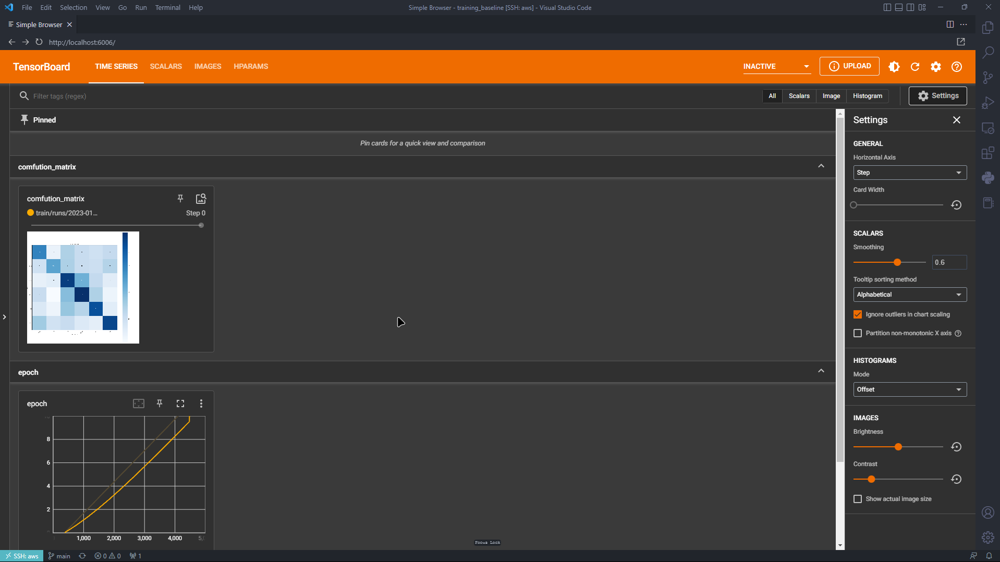
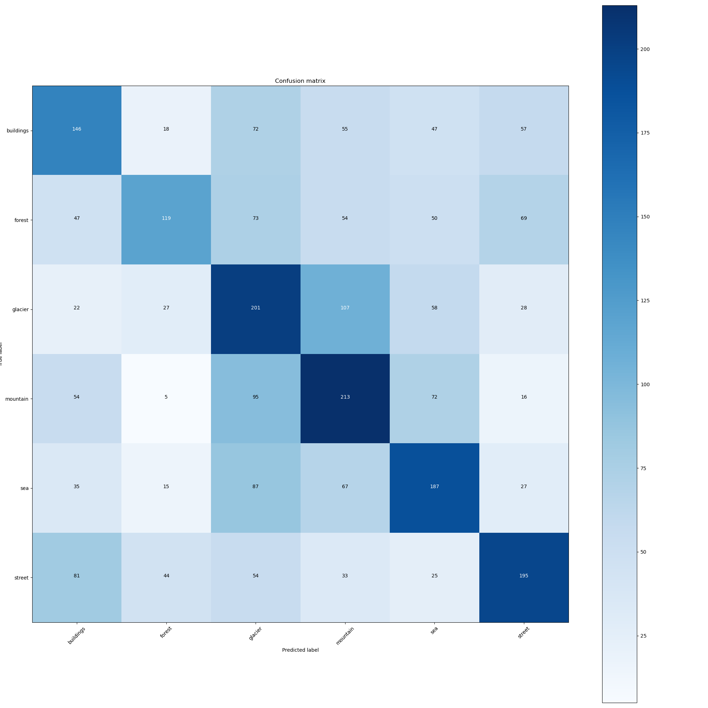

# CAPSTONE

1. Use this Dataset https://www.kaggle.com/datasets/puneet6060/intel-image-classification
2. Train any pretrained model from `timm`

Description

- This project uses the [Intel Image Classification](https://www.kaggle.com/datasets/puneet6060/intel-image-classification) dataset to train a pretrained model from [timm](https://github.com/rwightman/pytorch-image-models). The goal is to use hyperparameter search to find the best starting parameters for the pipeline and evaluate the model based on its accuracy on the test dataset. 


3.  Model Metrics to be logged

    - F1 Score
    - Precision
    - Recall
    - onfusion Matrix (Can be Image in Tensorboard)

All the logs has been [logged to the Tensorboard](https://tensorboard.dev/experiment/d31Ngs04Q2SMmee3exgvXQ/#scalars)




4. Do a hyperparam search to determine the best starting parameters for the pipeline.

- Evaluation hyperparam is based on Model Accuracy on Test Dataset
- Use GPU on AWS/Colab for faster experimentation
- Logs go to tensorboard
- Hyperparams are
  - model
  - optimizer
  - learning rate

These are the Best Hyperparamerters: 
```
best_params:
  model.net.model_name: efficientnet_b3a
  model.optimizer._target_: torch.optim.Adam
  model.optimizer.lr: 0.0052086233463775385
  model.optimizer.weight_decay: 0
  datamodule.batch_size: 32
best_value: 0.9397495985031128

```
